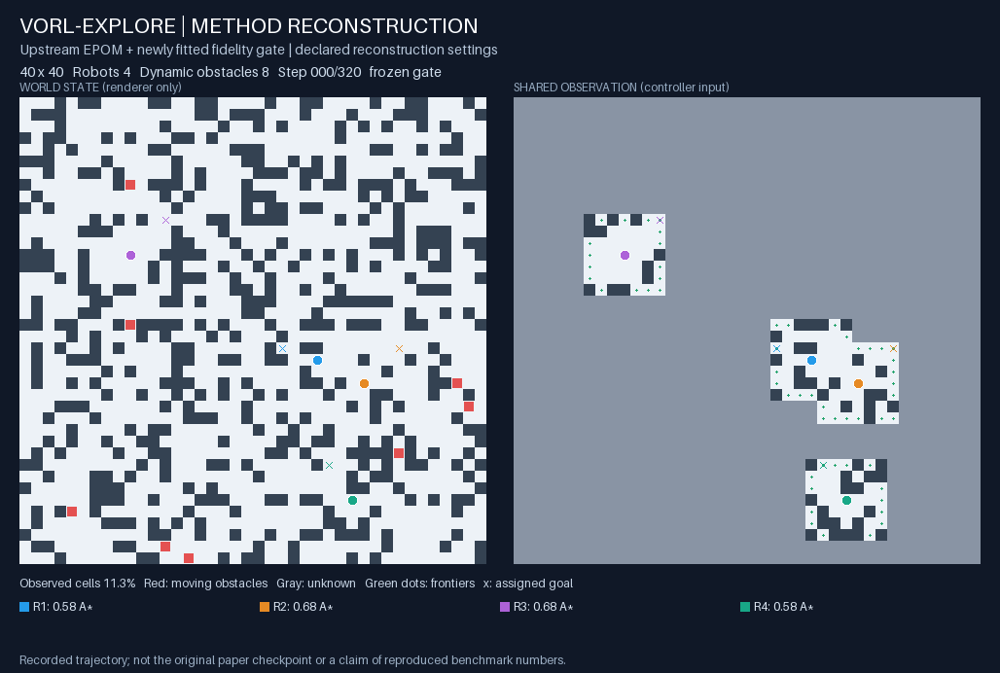
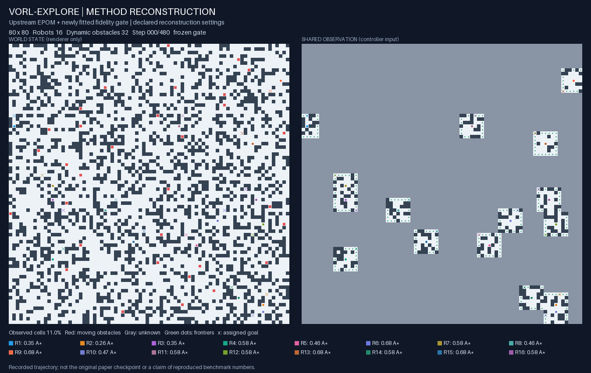

# VORL-EXPLORE
Official repository for "VORL-EXPLORE: A Hybrid Learning Planning Approach to Multi-Robot Exploration in Dynamic Environments" (IROS 2026). A closed-loop multi-robot exploration framework featuring execution fidelity, self-supervised adaptation, and hybrid planning.


## Executable method reconstruction

This release runs the coupled method with a genuine EPOM policy, a newly fitted
eight-feature fidelity gate, hysteresis, recovery and dynamic obstacles. It is a
**method-level reconstruction**, not the unpublished original implementation or
a reproduction of the paper's benchmark numbers. The EPOM checkpoint comes from
the supplied reference project's upstream release; the gate is trained here.
See [scope and declared differences](docs/RECONSTRUCTION_SCOPE.md).

The implementation and its environment are independent of CARE. No CARE source,
environment, communication model, or result files are required.

## Run on Linux / Python 3.10

Create a new environment inside a dedicated VORL checkout:

```bash
git clone https://github.com/21ning/VORL-EXPLORE.git
cd VORL-EXPLORE
python3.10 -m venv .venv
source .venv/bin/activate
python -m pip install -r requirements-cpu.lock
python scripts/fetch_epom.py --output models/epom
python -m pytest -q
```

The downloader verifies pinned hashes. The 116 MB EPOM policy is intentionally
not stored in Git; an existing destination is never overwritten. GPU is not
required. Use a fresh output directory for every run.

```bash
python scripts/run_vorl.py --policy-dir models/epom --gate checkpoints/fidelity-gate.json --size 40 --seed 1000 --dynamic-obstacles 8 --output runs/demo40
python scripts/run_vorl.py --policy-dir models/epom --gate checkpoints/fidelity-gate.json --size 80 --seed 1001 --dynamic-obstacles 32 --output runs/demo80
python scripts/verify_rollout.py --run runs/demo40 --gate checkpoints/fidelity-gate.json
python scripts/verify_rollout.py --run runs/demo80 --gate checkpoints/fidelity-gate.json
python scripts/render_rollout.py --run runs/demo40 --output runs/demo40/gif
python scripts/render_rollout.py --run runs/demo80 --output runs/demo80/gif
```

Main evaluation freezes the gate. `--adapt` enables a separate adaptation run;
it is not used for the examples below. Runtime guards reject an unfitted gate,
configuration mismatch or reuse of a training seed for evaluation.

## Verified examples

These are two executability checks, not a statistical benchmark. Both execute
A*, real EPOM and recovery, with recorded transitions and frozen-gate checks.
Both reach their time limits with residual frontiers; **neither is reported as
complete exploration**. Full data and checks are under `examples/`.

| Scenario | Steps | Observed cells | Termination |
| --- | ---: | ---: | --- |
| 40×40, 4 robots, 8 moving obstacles, seed 1000 | 320 | 99.6875% | Horizon; residual frontiers |
| 80×80, 16 robots, 32 moving obstacles, seed 1001 | 480 | 99.8438% | Horizon; residual frontiers |





The left panel is world truth available only to the renderer; the right panel is
the shared observation supplied to the controller. Red cells are moving obstacles,
green dots are frontiers, crosses are assigned goals, and legend values are
actual gate scores and execution modes.

## Refit the warm-start gate

```bash
python scripts/warmstart_gate.py --policy-dir models/epom --output runs/warmstart --workers 4 --threads 8
```

This collects seeds 0–3 on 64×64 maps with 64 robots, fits regularized logistic
regression from delayed execution outcomes, and saves `fidelity-gate.json`.
The supplied checkpoint used 46,860 clear-margin samples. All reconstruction
settings are fixed in `configs/reconstruction.json`. This refits the small gate,
**not** the large upstream EPOM policy.

These examples include the [recovery and switch-counting correction](docs/RECOVERY_FIX.md).
The numerical implementation is in `vorl/`; command-line entry points are in
`scripts/`. The historical reference-only diagnostic is separate and is never
labeled as the main method. See the [run report](docs/REPRODUCTION_REPORT.md),
[source audit](docs/SOURCE_AUDIT.md), [model provenance](docs/UPSTREAM_ARTIFACTS.md)
and [third-party notices](THIRD_PARTY_NOTICES.md). The
[completion evidence](docs/COMPLETION_AUDIT.md) maps each requested deliverable
to implementation and runtime checks.
