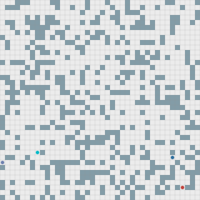

# VORL-EXPLORE



**A Hybrid Learning Planning Approach to Multi-Robot Exploration in Dynamic Environments**

VORL-EXPLORE couples frontier assignment and motion execution through a shared
execution-fidelity score. The score adjusts a Voronoi-based frontier objective
and controls a hysteresis switch between A* planning and an EPOM reactive policy.
The implementation includes dynamic grid environments, recovery actions and
optional self-supervised gate updates.

## Demo

The displayed successful rollout is the shortest completed run among ten fixed
evaluation seeds: **40×40 grid, 4 robots, 12 moving obstacles, seed 1010**.
Exploration completes in **163 steps**, with no remaining frontiers and 100%
observed cells. It is rendered with **Pogema 1.1.1 AnimationMonitor** in
observer view: the original terrain remains visible, while cells not yet observed
by the team receive a 15% gray overlay. This display-only overlay does not change
the agents' recorded shared map or policy inputs. Grid lines remain visible;
colored circles/rings are robots/assigned frontiers.
Moving obstacles appear as gray squares during motion and return to ordinary
obstacle cells when stationary. The motion highlight uses recorded displacement
between consecutive states.

Normal Pogema playback: **0.28 seconds per step**, with every step retained.
The full GIF lasts **49 seconds**, including the intro and final hold.

[Native animated SVG](media/successful-exploration.svg) ·
[Run metadata](media/successful-exploration.json).
This selected example is not a success-rate benchmark.

<details>
<summary>Reproduce this animation after installation</summary>

```bash
python scripts/run_vorl.py --seed 1010 --dynamic-obstacles 12 --horizon 640 --threads 1 --output runs/success-demo
python scripts/verify_rollout.py --run runs/success-demo
.venv-animation/bin/python scripts/render_rollout.py --run runs/success-demo --output runs/success-demo/render --observer --require-success
```

Set up the separate animation environment below before the last command.

</details>

## Installation

Linux and Python 3.10 are the supported runtime. CPU inference is supported;
CUDA is not required.

```bash
git clone --depth 1 https://github.com/21ning/VORL-EXPLORE.git
cd VORL-EXPLORE
python3.10 -m venv .venv
source .venv/bin/activate
python -m pip install -r requirements-cpu.lock
python -m pip install --no-deps --no-build-isolation -e .
python scripts/fetch_epom.py --output models/epom
```

The downloader verifies the upstream release and checkpoint hashes. Model
weights are downloaded separately and are not stored in this repository.

## Quick start

```bash
python scripts/run_vorl.py --output runs/demo
```

This runs a 40×40 dynamic grid with 4 robots, 8 moving obstacles and a frozen
fidelity gate. For a larger scene:

```bash
python scripts/run_vorl.py --size 80 --robots 16 --dynamic-obstacles 32 --seed 1001 --output runs/demo80
```

Useful options:

| Option | Default | Description |
| --- | --- | --- |
| `--size` | `40` | Grid size: `40` or `80` |
| `--robots` | `4` / `16` | Team size, selected by grid size |
| `--dynamic-obstacles` | `8` | Number of moving obstacles |
| `--seed` | `1000` | Environment and policy random seed |
| `--horizon` | `320` / `480` | Maximum decision steps |
| `--threads` | `4` | CPU threads for policy inference |
| `--adapt` | off | Enable online fidelity-gate updates |

Use `--help` for model and configuration paths. Each run requires a new output
directory and saves its configuration, summary, trajectory and allocation log.
Completion means no frontiers remain; a horizon-limited run is recorded as
incomplete.

## Tools

```bash
# Check a recorded frozen-gate run.
python scripts/verify_rollout.py --run runs/demo

# Fit a new warm-start gate; this does not train the EPOM policy.
python scripts/warmstart_gate.py --output runs/warmstart --workers 2 --threads 2

# Run unit tests; no downloaded policy is required.
python -m pytest
```

To use a newly fitted gate, pass `--gate runs/warmstart/fidelity-gate.json`.
Keep fitting and run configurations identical, and use evaluation seeds outside
the gate's training seeds. See [configuration and implementation notes](docs/implementation.md).

### Pogema animation (optional)

Use a separate Python 3.10 environment because Pogema 1.1.1 and the inference
runtime require different NumPy versions. On Debian/Ubuntu, CairoSVG also needs
`libcairo2` (`sudo apt-get install libcairo2` if absent).

```bash
python3.10 -m venv .venv-animation
.venv-animation/bin/python -m pip install -r requirements-animation.txt
.venv-animation/bin/python scripts/render_rollout.py --run runs/demo --output runs/demo/render
```

Outputs: native `vorl-explore.svg`, a GIF of native Pogema frames, and
`render-check.json`. `--svg-only` works with an existing Pogema 1.1.1 installation
without CairoSVG. `--require-success` rejects incomplete runs. The renderer
checks trajectory/config hashes and replays shared sensing before drawing.
It replays the recorded VORL simulator states; it does not replace the simulator
with Pogema physics. No policy weights or PyTorch are needed for animation.

Add `--observer` for a full-map presentation: original terrain stays visible
under a 15% gray overlay in unexplored regions. Moving obstacles are gray squares
and stationary ones use the ordinary obstacle style. This viewer-only mode does
not change the agents' observations or their recorded shared map.

Renderer tests: install `pytest==8.4.2` in the animation environment and run
`.venv-animation/bin/python -m pytest tests/test_render.py`.

## Project structure

```text
vorl/          Frontier allocation, fidelity, controller, policy and environment
scripts/       Run, download, gate fitting, trajectory validation and rendering
configs/       Default method configuration
checkpoints/   Lightweight warm-start gate
tests/         Unit and command-line tests
```

## Implementation scope

This is a runnable method-level implementation using an upstream EPOM checkpoint
and a separately fitted fidelity gate. It does not reproduce the paper's
from-scratch policy training or benchmark tables. Apart from the illustrative
demo above, this release contains code and usage documentation, not benchmark
results, ablation suites or Gazebo integration.

EPOM is based on [When to Switch](https://github.com/Cognitive-AI-Systems/when-to-switch)
and uses Sample Factory. See [third-party notices](THIRD_PARTY_NOTICES.md) for
attribution and license terms.
